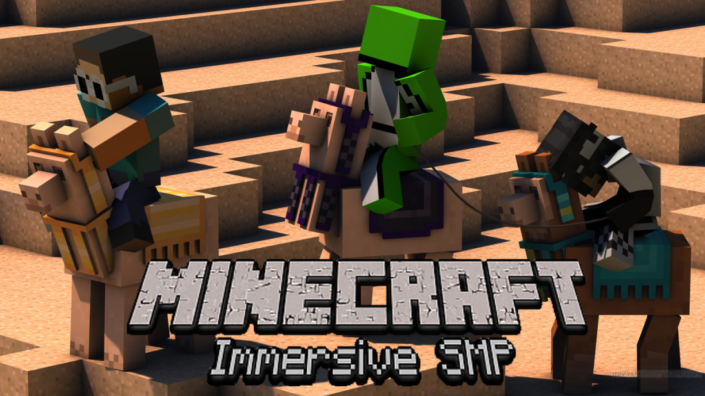
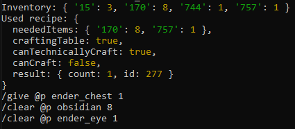
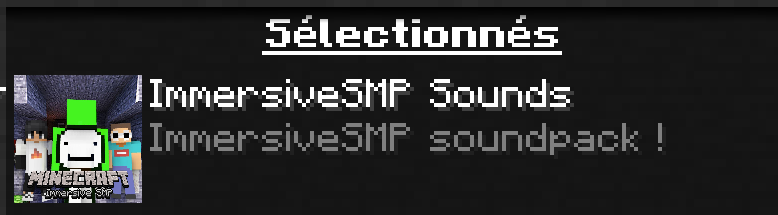
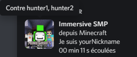
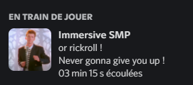

# **Immersive SMP Project**


[French version](./README-fr.md)



___

## Introduction


Salut joueurs de Minecraft !<br>
Aujourd'hui, nous annonçons la sortie du **Projet SMP Immersif** !<br>
Je sais que certains membres de Discord sont ravis de tester ce projet, alors je publie la **version 1.0**.
Permettez-moi de présenter en quoi consiste le projet.

## Quel est donc ce projet ?

Je souhaitais recréer un **environnement immersive du Manhunt** où la Dream Team *(Dream, Sapnap, GerogeNotFound, BadBoyHalo et autres...)* te poursuivrais.<br>
Nous avons codés les bots pour qu'ils puissent:
- miner et poser des blocs
- crafter du stuff
- manger pour se soigner ou pour se nourrir
- attaquer
- et  leur faire dire des choses grâce à une **soundboard** sur laquelle nous avons travaillé avec mon équipe selon leur environnement et leurs statistiques *(PV, inventaire, blocs alentours)* pour une __**immersion vocale puissante**__...<br>

L'idée, c'est justement une **immersion**, une simulation exceptionnelle où la vraie équipe de Dream nous traquerait.<br>
Cela devrait donner  une **expérience** assez unique !<br>
Et peut être même un nouveau concept de vidéos .<br>

Une démo de l'étape de farm du bot: https://youtu.be/yhGObriFxzA

## Version avec `node.exe` inclus

Pour ceux qui n'ont pas NodeJS installé sur leur machines, vous pouvez soit le télécharger via leur site https://nodejs.org/download (Version 16 minimum requise), ou télécharger la version qui fournit NodeJS via [cette branche](https://github.com/fox3000foxy/ImmersiveManhunt/tree/with-node) du projet.

## Configuration

Vous pouvez constater la présence d'un fichier `config.json`.<br>
Celui ci permet de configurer votre immersion:
```json
{
	"huntedName": "pseudo", // Votre pseudo
	"botsNames": ["hunter1","hunter2"], // Les noms de vos assaillants
	"host": "localhost", // L'ip de la partie, par défaut "localhost"
	"port": 25565, // Le port de la partie, par défaut 25565
	"autoStart": true,
    // Si true, commence à farmer dès qu'un mouvement est détecté
    // Si false, ne commence que lorsque le joueur tapes "start" dans le chat
	"ostId": 1 // L'id de la musique jouée par le jeu
}
```

Vous devrez aussi baisser le volume de la musique dans vos options.<br>
Un serveur où le `online-mode=false` est requis. (Une ouverture au LAN de votre partie solo marche aussi)<br>
Vous devrez aussi rendre ces commandes accessible aux bots:
- `/give` et `/clear` (pour le craft)<br>
Example de craft: <br>
- `/spreadplayers` (pour se rendre dans une zone proche de vous dès que le bot vous signale impossible à trouver)
- `/playsound` et `/stopsound` (pour pouvoir jouer la soundboard et la musique incluse dans le programme)
- `/gamerule sendCommandFeedback false` (pour éviter la pollution du chat)
- et `/replaceitem` (pour pouvoir équiper l'armure)

## Soundpack
Comme annoncé plus haut, une soundboard a été créée pour rajouter une touche de réalisme dans votre immersion ! Cependant, elle nécessite l'installation d'un resourcepack présent dans ce dépot.<br><br>


## RPC Discord

Vous pourrez apercevoir, si vous avez l'application Discord d'ouvert, que vous jouez à **Imersive SMP** ! Cela est du à un module qui permet de l'afficher. Vous pourrez y voir votre nom, et celui de ceux que vous affrontrez: <br>



En parlant de Discord, vous pouvez rejoindre le notre si vous avez des questions, ou si vous voulez nous soutenir:<br>

https://discord.gg/SkW9j8xzyF<br>
<a href="https://discord.gg/SkW9j8xzyF"></a>

## Prochainement

- Optimisation du code
- Apprendre d'autres comportements à l'IA
- Essayer de se passer des commandes `/give` et `/clear`

## Easteregg

Si vous êtes curieux, vous pouvez exécuter `node rickroll.js` dans une console de commande qui réfère au dossier.
Vous obtiendrez un RPC Discord tout autre !
<details>
  <summary>Voir le résultat</summary>

  
</details>
