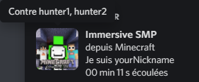
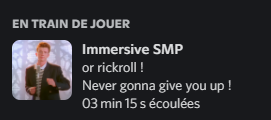

# **Immersive SMP Project**


[French version](./README-fr.md)


## Introduction

Hi Minecraft players!<br>
Today we announce the release of the **Immersive SMP Project**!<br>
I know some Discord members are excited to test this project, so I'm posting **version 1.0**.
Let me introduce what the project is about.

## So what is this project?

I wanted to recreate an **immersive Manhunt environment** where the Dream Team *(Dream, Sapnap, GerogeNotFound, BadBoyHalo and others...)* would chase you.<br>
We've coded the bots so they can:
- mine and dig blocks
- craft stuff
- eat for treatment or for food
- attack
- and make them say things thanks to a **soundboard** on which we worked with my team according to their environment and their statistics *(HP, inventory, surrounding blocks)* for a __**powerful vocal immersion**__ ...<br>

The idea is precisely an **immersion**, an exceptional simulation where the real Dream team would hunt us down.<br>
This should make for a pretty unique **experience**!<br>
And maybe even a new concept of videos.<br>

A demo of the bot's farm stage: https://youtu.be/yhGObriFxzA

## Version with `node.exe` included

For those who don't have NodeJS installed on their machines, you can either download it via their site https://nodejs.org/download (Version 16 minimum required), or download the version that provides NodeJS via [this branch]( https://github.com/fox3000foxy/ImmersiveManhunt/tree/with-node) of the project.

## Setup

You can see the presence of a `config.json` file.<br>
This allows you to configure your immersion:
```json
{
"huntedName": "nickname", // Your nickname
"botsNames": ["hunter1","hunter2"], // The names of your attackers
"host": "localhost", // The ip of the game, by default "localhost"
"port": 25565, // The port of the game, default 25565
"autoStart": true,
    // If true, start farming as soon as movement is detected
    // If false, start only when player types "start" in chat
"ostId": 1 // The id of the music played by the game
}
```

You will also need to lower the music volume in your options.<br>
A server where `online-mode=false` is required. (Opening your solo part to LAN also works)<br>
You will also need to make these commands available to bots:
- `/give` and `/clear` (for crafting)<br>
Example craft: <br>
- `/spreadplayers` (to go to an area near you as soon as the bot tells you impossible to find)
- `/playsound` and `/stopsound` (to be able to play the soundboard and the music included in the program)
- `/gamerule sendCommandFeedback false` (to avoid chat pollution)
- and `/replaceitem` (to be able to equip the armor)

## Soundpack
As announced above, a soundboard has been created to add a touch of realism to your immersion! However, it requires the installation of a resourcepack present in this repository.<br><br>


## RPC Discord

You will be able to see, if you have the Discord app open, that you are playing **Imersive SMP**! This is due to a module that displays it. You will be able to see your name there, and that of those you will face: <br>



About Discord, you can join ours if you have any questions, or want to support us:<br>

https://discord.gg/SkW9j8xzyF<br>
<a href="https://discord.gg/SkW9j8xzyF"></a>

## Soon

- Code optimization
- Teach other AI behaviors
- Try to do without the `/give` and `/clear` commands

## Easter Egg

If you're curious, you can run `node rickroll.js` in a command console that references the folder.
You will get a completely different Discord RPC!
<details>
  <summary>View result</summary>

  
</details>
